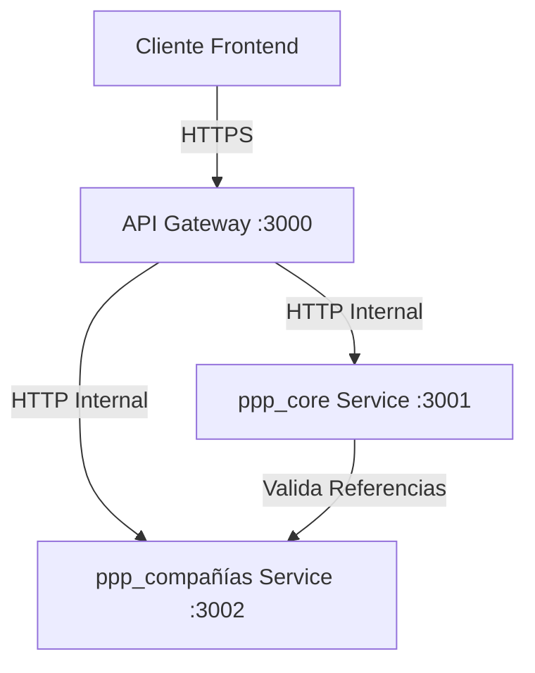

# PPP Microservices API - Documentación Completa (Parte 1)

## 📋 Tabla de Contenidos - Parte 1

1. [Información General](#información-general)
2. [Arquitectura del Sistema](#arquitectura-del-sistema)
3. [Autenticación y Seguridad](#autenticación-y-seguridad)
4. [Módulos del Sistema - ppp_core](#módulos-del-sistema---ppp_core)
5. [Ejemplos de Uso Completos](#ejemplos-de-uso-completos)

---

## 🌐 Información General

### Base URL de Producción
```
https://ppaz-api-gateway.whitesand-5e7ae56f.brazilsouth.azurecontainerapps.io
```

### Información de Despliegue
- **Entorno**: Azure Container Apps (Brazil South)
- **Gateway Version**: v9
- **Core Service**: v4 (6 módulos)
- **Compañías Service**: v6 (4 módulos)
- **Estado**: ✅ Producción - Todos los endpoints operativos

### Headers Requeridos
```http
Content-Type: application/json
Accept: application/json
```

### Formatos de Respuesta

#### Respuesta Exitosa (2xx)
```json
{
  "id": "uuid-del-recurso",
  "campo1": "valor1",
  "campo2": "valor2",
  "createdAt": "2025-11-08T19:51:32.908Z",
  "updatedAt": "2025-11-08T19:51:32.908Z"
}
```

#### Respuesta de Error (4xx/5xx)
```json
{
  "statusCode": 400,
  "message": "Descripción del error",
  "error": "Bad Request"
}
```

### Códigos de Estado HTTP Comunes

| Código | Significado | Cuándo ocurre |
|--------|-------------|---------------|
| 200 | OK | Operación exitosa (GET, PATCH) |
| 201 | Created | Recurso creado exitosamente (POST) |
| 204 | No Content | Recurso eliminado exitosamente (DELETE) |
| 400 | Bad Request | Datos de entrada inválidos o faltantes |
| 404 | Not Found | Recurso no encontrado |
| 409 | Conflict | Conflicto con recurso existente (ej: DNI duplicado) |
| 500 | Internal Server Error | Error del servidor (contactar backend) |

---

## 🏗️ Arquitectura del Sistema

### Microservicios Disponibles



### Distribución de Módulos

#### 🔵 ppp_core (6 módulos)
- Usuarios
- Alumnos
- Profesores
- Coordinadores
- Secretarias
- Escuelas

#### 🟢 ppp_compañías (4 módulos)
- Tipo Documentos
- Documentos
- Empresas
- Cartas de Presentación

### Comunicación Entre Servicios

**Importante**: Los servicios se comunican internamente mediante HTTP. El servicio `ppp_compañías` valida referencias a recursos de `ppp_core` (como alumnos, secretarias) mediante llamadas HTTP internas.

---

## 🔐 Autenticación y Seguridad

### Estado Actual
⚠️ **Actualmente NO hay autenticación implementada**. Todos los endpoints son públicos.

### Próximas Implementaciones (Recomendado)
```http
Authorization: Bearer <JWT_TOKEN>
```

### Roles Futuros
- `ALUMNO`: Acceso a sus propios recursos
- `PROFESOR`: Supervisión de alumnos
- `COORDINADOR`: Gestión de escuela
- `SECRETARIA`: Gestión administrativa
- `ADMIN`: Acceso completo

---

## 📦 Módulos del Sistema - ppp_core

---

## 1. 👤 USUARIOS

### Modelo de Datos
```typescript
{
  id: string;              // UUID autogenerado
  nombres: string;         // Requerido
  apellidos: string;       // Requerido
  email: string;          // Requerido, único
  contraseña?: string;    // Opcional (será requerido con auth)
  activo: boolean;        // Default: true
  createdAt: Date;        // Autogenerado
  updatedAt: Date;        // Autogenerado
}
```

### Endpoints Disponibles

#### ✅ Crear Usuario
```http
POST /usuarios
```

**Request Body**:
```json
{
  "nombres": "Juan Carlos",
  "apellidos": "Pérez García",
  "email": "juan.perez@upeu.edu.pe",
  "contraseña": "password123"
}
```

**Response 201**:
```json
{
  "id": "c35e0fbe-16e2-455d-ac32-7b558215ceb6",
  "nombres": "Juan Carlos",
  "apellidos": "Pérez García",
  "email": "juan.perez@upeu.edu.pe",
  "activo": true,
  "createdAt": "2025-11-08T19:51:32.908Z",
  "updatedAt": "2025-11-08T19:51:32.908Z"
}
```

**Validaciones**:
- `nombres`: No vacío
- `apellidos`: No vacío
- `email`: Formato email válido, único en el sistema
- Si el email ya existe: **409 Conflict**

#### ✅ Listar Todos los Usuarios
```http
GET /usuarios
```

**Response 200**:
```json
[
  {
    "id": "c35e0fbe-16e2-455d-ac32-7b558215ceb6",
    "nombres": "Juan Carlos",
    "apellidos": "Pérez García",
    "email": "juan.perez@upeu.edu.pe",
    "activo": true,
    "createdAt": "2025-11-08T19:51:32.908Z",
    "updatedAt": "2025-11-08T19:51:32.908Z"
  }
]
```

#### ✅ Obtener Usuario por ID
```http
GET /usuarios/{id}
```

**Parámetros**:
- `id`: UUID del usuario

**Response 200**:
```json
{
  "id": "c35e0fbe-16e2-455d-ac32-7b558215ceb6",
  "nombres": "Juan Carlos",
  "apellidos": "Pérez García",
  "email": "juan.perez@upeu.edu.pe",
  "activo": true
}
```

**Errores**:
- Usuario no existe: **404 Not Found**

#### ✅ Obtener Usuario por Email
```http
GET /usuarios/email/{email}
```

**Ejemplo**:
```http
GET /usuarios/email/juan.perez@upeu.edu.pe
```

#### ✅ Actualizar Usuario
```http
PATCH /usuarios/{id}
```

**Request Body** (todos los campos opcionales):
```json
{
  "nombres": "Juan Carlos Actualizado",
  "apellidos": "Pérez López",
  "email": "nuevo.email@upeu.edu.pe",
  "activo": false
}
```

#### ✅ Eliminar Usuario
```http
DELETE /usuarios/{id}
```

**Response**: 204 No Content

---

## 2. 🎓 ALUMNOS

### Modelo de Datos
```typescript
{
  id: string;              // UUID autogenerado
  usuarioId: string;       // FK a Usuario, requerido
  idEscuela: string;       // FK a Escuela, requerido
  codigo: string;          // Código único del alumno, requerido
  ciclo: string;           // Ej: "VIII", requerido
  año: string;            // Año de ingreso, requerido
  createdAt: Date;
  updatedAt: Date;
  
  // Relaciones incluidas
  usuario?: Usuario;
  escuela?: Escuela;
}
```

### Endpoints Disponibles

#### ✅ Crear Alumno
```http
POST /alumnos
```

**Request Body**:
```json
{
  "usuarioId": "c35e0fbe-16e2-455d-ac32-7b558215ceb6",
  "idEscuela": "0357901b-df1f-49e1-9622-6effaee85d4a",
  "codigo": "2021001224",
  "ciclo": "VIII",
  "año": "2021"
}
```

**Response 201**:
```json
{
  "id": "16f204a6-8b1e-4669-a26d-1672c9878fb2",
  "usuarioId": "c35e0fbe-16e2-455d-ac32-7b558215ceb6",
  "idEscuela": "0357901b-df1f-49e1-9622-6effaee85d4a",
  "codigo": "2021001224",
  "ciclo": "VIII",
  "año": "2021",
  "createdAt": "2025-11-08T19:51:32.908Z",
  "updatedAt": "2025-11-08T19:51:32.908Z",
  "usuario": {
    "id": "c35e0fbe-16e2-455d-ac32-7b558215ceb6",
    "nombres": "Juan Carlos",
    "apellidos": "Pérez García",
    "email": "juan.perez@upeu.edu.pe",
    "activo": true
  },
  "escuela": {
    "id": "0357901b-df1f-49e1-9622-6effaee85d4a",
    "nombre": "Escuela Profesional de Ingeniería de Sistemas",
    "codigo": "ESC-SIS"
  }
}
```

**Validaciones**:
- `usuarioId`: Debe existir en la tabla usuarios
- `idEscuela`: Debe existir en la tabla escuelas
- `codigo`: Único por alumno
- Si el usuario o escuela no existe: **404 Not Found**
- Si el código ya existe: **409 Conflict**

#### ✅ Listar Todos los Alumnos
```http
GET /alumnos
```

**Response 200**: Array de alumnos con relaciones incluidas

#### ✅ Obtener Alumno por ID
```http
GET /alumnos/{id}
```

**Response 200**: Alumno con relaciones (usuario, escuela)

#### ✅ Obtener Alumnos por Escuela
```http
GET /alumnos/escuela/{idEscuela}
```

**Ejemplo**:
```http
GET /alumnos/escuela/0357901b-df1f-49e1-9622-6effaee85d4a
```

**Response 200**: Array de alumnos de esa escuela

#### ✅ Obtener Alumno por Código
```http
GET /alumnos/codigo/{codigo}
```

**Ejemplo**:
```http
GET /alumnos/codigo/2021001224
```

#### ✅ Actualizar Alumno
```http
PATCH /alumnos/{id}
```

**Request Body** (campos opcionales):
```json
{
  "ciclo": "IX",
  "año": "2022"
}
```

#### ✅ Eliminar Alumno
```http
DELETE /alumnos/{id}
```

---

## 3. 👨‍🏫 PROFESORES

### Modelo de Datos
```typescript
{
  id: string;              // UUID autogenerado
  usuarioId: string;       // FK a Usuario, requerido
  idEscuela: string;       // FK a Escuela, requerido
  especialidad: string;    // Requerido
  gradoAcademico: string;  // Requerido
  activo: boolean;         // Default: true
  createdAt: Date;
  updatedAt: Date;
  
  // Relaciones
  usuario?: Usuario;
  escuela?: Escuela;
}
```

### Endpoints Disponibles

#### ✅ Crear Profesor
```http
POST /profesores
```

**Request Body**:
```json
{
  "usuarioId": "a1b2c3d4-1234-5678-9012-e1f2a3b4c5d6",
  "idEscuela": "0357901b-df1f-49e1-9622-6effaee85d4a",
  "especialidad": "Ingeniería de Software",
  "gradoAcademico": "Doctor en Ciencias de la Computación"
}
```

**Response 201**:
```json
{
  "id": "7a8b9c0d-1234-5678-9012-e1f2a3b4c5d6",
  "usuarioId": "a1b2c3d4-1234-5678-9012-e1f2a3b4c5d6",
  "idEscuela": "0357901b-df1f-49e1-9622-6effaee85d4a",
  "especialidad": "Ingeniería de Software",
  "gradoAcademico": "Doctor en Ciencias de la Computación",
  "activo": true,
  "createdAt": "2025-11-08T20:00:00.000Z",
  "updatedAt": "2025-11-08T20:00:00.000Z",
  "usuario": {
    "nombres": "María Elena",
    "apellidos": "González Pérez",
    "email": "maria.gonzalez@upeu.edu.pe"
  },
  "escuela": {
    "nombre": "Escuela Profesional de Ingeniería de Sistemas",
    "codigo": "ESC-SIS"
  }
}
```

**Validaciones**:
- `usuarioId`: Debe existir
- `idEscuela`: Debe existir
- `especialidad`: No vacío
- `gradoAcademico`: No vacío

#### ✅ Otros Endpoints de Profesores
```http
GET /profesores                              # Listar todos
GET /profesores/{id}                         # Obtener por ID
GET /profesores/escuela/{idEscuela}          # Por escuela
GET /profesores/especialidad/{especialidad}   # Por especialidad
GET /profesores/activos                      # Solo activos
PATCH /profesores/{id}                       # Actualizar
DELETE /profesores/{id}                      # Eliminar
```

---

## 4. 👔 COORDINADORES

### Modelo de Datos
```typescript
{
  id: string;
  usuarioId: string;       // FK a Usuario
  idEscuela: string;       // FK a Escuela
  fechaInicio: Date;       // Requerido
  fechaFin?: Date;         // Opcional
  activo: boolean;
  createdAt: Date;
  updatedAt: Date;
  
  // Relaciones
  usuario?: Usuario;
  escuela?: Escuela;
}
```

### Endpoints Disponibles

#### ✅ Crear Coordinador
```http
POST /coordinadores
```

**Request Body**:
```json
{
  "usuarioId": "b2c3d4e5-1234-5678-9012-f1g2h3i4j5k6",
  "idEscuela": "0357901b-df1f-49e1-9622-6effaee85d4a",
  "fechaInicio": "2025-01-01"
}
```

**Campos Opcionales**:
```json
{
  "fechaFin": "2025-12-31"  // Si no se especifica, sigue activo
}
```

**Response 201**:
```json
{
  "id": "8b9c0d1e-1234-5678-9012-f1g2h3i4j5k6",
  "usuarioId": "b2c3d4e5-1234-5678-9012-f1g2h3i4j5k6",
  "idEscuela": "0357901b-df1f-49e1-9622-6effaee85d4a",
  "fechaInicio": "2025-01-01T00:00:00.000Z",
  "fechaFin": null,
  "activo": true,
  "createdAt": "2025-11-08T20:00:00.000Z",
  "updatedAt": "2025-11-08T20:00:00.000Z"
}
```

#### ✅ Otros Endpoints de Coordinadores
```http
GET /coordinadores                           # Listar todos
GET /coordinadores/{id}                      # Obtener por ID
GET /coordinadores/escuela/{idEscuela}       # Por escuela
GET /coordinadores/activos                   # Solo activos
PATCH /coordinadores/{id}                    # Actualizar
DELETE /coordinadores/{id}                   # Eliminar
```

---

## 5. 👩‍💼 SECRETARIAS

### Modelo de Datos
```typescript
{
  id: string;
  usuarioId: string;       // FK a Usuario
  idEscuela: string;       // FK a Escuela
  cargo: string;           // Requerido
  activo: boolean;
  createdAt: Date;
  updatedAt: Date;
  
  // Relaciones
  usuario?: Usuario;
  escuela?: Escuela;
}
```

### Endpoints Disponibles

#### ✅ Crear Secretaria
```http
POST /secretarias
```

**Request Body**:
```json
{
  "usuarioId": "c3d4e5f6-1234-5678-9012-g1h2i3j4k5l6",
  "idEscuela": "0357901b-df1f-49e1-9622-6effaee85d4a",
  "cargo": "Secretaria Académica"
}
```

**Response 201**:
```json
{
  "id": "9c0d1e2f-1234-5678-9012-g1h2i3j4k5l6",
  "usuarioId": "c3d4e5f6-1234-5678-9012-g1h2i3j4k5l6",
  "idEscuela": "0357901b-df1f-49e1-9622-6effaee85d4a",
  "cargo": "Secretaria Académica",
  "activo": true,
  "createdAt": "2025-11-08T20:00:00.000Z",
  "updatedAt": "2025-11-08T20:00:00.000Z"
}
```

#### ✅ Otros Endpoints de Secretarias
```http
GET /secretarias                    # Listar todas
GET /secretarias/{id}               # Obtener por ID
GET /secretarias/escuela/{idEscuela} # Por escuela
GET /secretarias/activas            # Solo activas
PATCH /secretarias/{id}             # Actualizar
DELETE /secretarias/{id}            # Eliminar
```

---

## 6. 🏫 ESCUELAS

### Modelo de Datos
```typescript
{
  id: string;
  nombre: string;          // Requerido
  codigo: string;          // Único, requerido
  facultadId: string;      // FK a Facultad, requerido
  createdAt: Date;
  updatedAt: Date;
  
  // Relaciones
  facultad?: Facultad;
}
```

### Endpoints Disponibles

#### ✅ Crear Escuela
```http
POST /escuelas
```

**Request Body**:
```json
{
  "nombre": "Escuela Profesional de Ingeniería de Sistemas",
  "codigo": "ESC-SIS",
  "facultadId": "d4e5f6g7-1234-5678-9012-h1i2j3k4l5m6"
}
```

**Response 201**:
```json
{
  "id": "0357901b-df1f-49e1-9622-6effaee85d4a",
  "nombre": "Escuela Profesional de Ingeniería de Sistemas",
  "codigo": "ESC-SIS",
  "facultadId": "d4e5f6g7-1234-5678-9012-h1i2j3k4l5m6",
  "createdAt": "2025-11-08T20:00:00.000Z",
  "updatedAt": "2025-11-08T20:00:00.000Z",
  "facultad": {
    "nombre": "Facultad de Ingeniería",
    "codigo": "FAC-ING"
  }
}
```

**Validaciones**:
- `codigo`: Único en el sistema
- `facultadId`: Debe existir
- Si el código ya existe: **409 Conflict**

#### ✅ Otros Endpoints de Escuelas
```http
GET /escuelas                        # Listar todas
GET /escuelas/{id}                   # Obtener por ID
GET /escuelas/codigo/{codigo}        # Por código
GET /escuelas/facultad/{facultadId}  # Por facultad
PATCH /escuelas/{id}                 # Actualizar
DELETE /escuelas/{id}                # Eliminar
```

---

## 📝 Ejemplos de Uso Completos

### Ejemplo 1: Crear un Alumno Completo

**Paso 1: Crear Usuario**
```bash
curl -X POST https://ppaz-api-gateway.whitesand-5e7ae56f.brazilsouth.azurecontainerapps.io/usuarios \
  -H "Content-Type: application/json" \
  -d '{
    "nombres": "Carlos",
    "apellidos": "Ramírez Torres",
    "email": "carlos.ramirez@upeu.edu.pe"
  }'
```

**Respuesta**:
```json
{
  "id": "e1f2g3h4-5678-9012-i1j2-k3l4m5n6o7p8",
  "nombres": "Carlos",
  "apellidos": "Ramírez Torres",
  "email": "carlos.ramirez@upeu.edu.pe",
  "activo": true
}
```

**Paso 2: Crear Alumno**
```bash
curl -X POST https://ppaz-api-gateway.whitesand-5e7ae56f.brazilsouth.azurecontainerapps.io/alumnos \
  -H "Content-Type: application/json" \
  -d '{
    "usuarioId": "e1f2g3h4-5678-9012-i1j2-k3l4m5n6o7p8",
    "idEscuela": "0357901b-df1f-49e1-9622-6effaee85d4a",
    "codigo": "2025001001",
    "ciclo": "I",
    "año": "2025"
  }'
```

### Ejemplo 2: Actualizar Ciclo de Alumno

```bash
curl -X PATCH https://ppaz-api-gateway.whitesand-5e7ae56f.brazilsouth.azurecontainerapps.io/alumnos/16f204a6-8b1e-4669-a26d-1672c9878fb2 \
  -H "Content-Type: application/json" \
  -d '{
    "ciclo": "IX"
  }'
```

### Ejemplo 3: Buscar Alumnos por Escuela

```bash
curl -X GET https://ppaz-api-gateway.whitesand-5e7ae56f.brazilsouth.azurecontainerapps.io/alumnos/escuela/0357901b-df1f-49e1-9622-6effaee85d4a
```

---

## 🔍 Patrones de Búsqueda Comunes

### Por ID
```http
GET /{recurso}/{id}
```

### Por Relación
```http
GET /{recurso}/escuela/{idEscuela}
GET /{recurso}/usuario/{usuarioId}
```

### Por Código/Email Único
```http
GET /usuarios/email/{email}
GET /alumnos/codigo/{codigo}
GET /escuelas/codigo/{codigo}
```

### Filtros Especiales
```http
GET /profesores/activos
GET /coordinadores/activos
GET /secretarias/activas
```

---

**📄 Continúa en PARTE 2**: Módulos de ppp_compañías, Manejo de Errores, Workflows Completos y Troubleshooting
