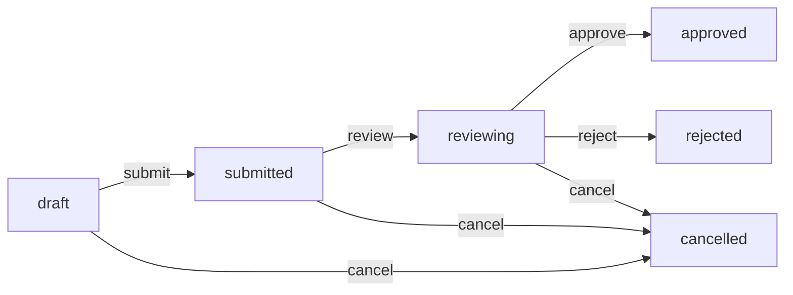

# PPP Microservices API - Documentación Completa (Parte 2)

## 📋 Tabla de Contenidos - Parte 2

1. [Módulos del Sistema - ppp_compañías](#módulos-del-sistema---ppp_compañías)
2. [Workflows Completos del Sistema](#workflows-completos-del-sistema)
3. [Manejo de Errores y Troubleshooting](#manejo-de-errores-y-troubleshooting)
4. [Validaciones y Reglas de Negocio](#validaciones-y-reglas-de-negocio)
5. [Preguntas Frecuentes (FAQ)](#preguntas-frecuentes-faq)

---

## 📦 Módulos del Sistema - ppp_compañías

---

## 7. 📄 TIPO DOCUMENTOS

### Modelo de Datos
```typescript
{
  id: string;              // UUID autogenerado
  nombre: string;          // Requerido, único
  descripcion?: string;    // Opcional
  requiereAprobacion: boolean; // Default: false
  createdAt: Date;
  updatedAt: Date;
}
```

### Endpoints Disponibles

#### ✅ Crear Tipo Documento
```http
POST /tipo-documentos
```

**Request Body**:
```json
{
  "nombre": "Carta de Presentación",
  "descripcion": "Documento para presentar al alumno en la empresa",
  "requiereAprobacion": true
}
```

**Response 201**:
```json
{
  "id": "f1g2h3i4-1234-5678-9012-j1k2l3m4n5o6",
  "nombre": "Carta de Presentación",
  "descripcion": "Documento para presentar al alumno en la empresa",
  "requiereAprobacion": true,
  "createdAt": "2025-11-08T20:00:00.000Z",
  "updatedAt": "2025-11-08T20:00:00.000Z"
}
```

**Validaciones**:
- `nombre`: Único, máximo 100 caracteres
- Si el nombre ya existe: **409 Conflict**

#### ✅ Otros Endpoints de Tipo Documentos
```http
GET /tipo-documentos           # Listar todos
GET /tipo-documentos/{id}      # Obtener por ID
PATCH /tipo-documentos/{id}    # Actualizar
DELETE /tipo-documentos/{id}   # Eliminar
```

---

## 8. 📎 DOCUMENTOS

### Modelo de Datos
```typescript
{
  id: string;              // UUID autogenerado
  idTipoDocumento: string; // FK a TipoDocumento, requerido
  nombreArchivo: string;   // Requerido (¡NO "nombre"!)
  rutaArchivo: string;     // Requerido
  subidoPor?: string;      // FK a Usuario, opcional
  generadoPor?: string;    // FK a Usuario, opcional
  createdAt: Date;
  updatedAt: Date;
  
  // Relaciones
  tipoDocumento?: TipoDocumento;
}
```

### ⚠️ IMPORTANTE: Campo nombreArchivo
**El campo se llama `nombreArchivo`, NO `nombre`**. Este fue un error común que se corrigió en la v9 del Gateway.

### Endpoints Disponibles

#### ✅ Crear Documento
```http
POST /documentos
```

**Request Body** (Campos Requeridos):
```json
{
  "idTipoDocumento": "f1g2h3i4-1234-5678-9012-j1k2l3m4n5o6",
  "nombreArchivo": "carta-presentacion-juan-perez.pdf",
  "rutaArchivo": "/storage/documentos/2025/11/carta-presentacion-juan-perez.pdf"
}
```

**Request Body** (Con Campos Opcionales):
```json
{
  "idTipoDocumento": "f1g2h3i4-1234-5678-9012-j1k2l3m4n5o6",
  "nombreArchivo": "carta-presentacion-juan-perez.pdf",
  "rutaArchivo": "/storage/documentos/2025/11/carta-presentacion-juan-perez.pdf",
  "subidoPor": "c35e0fbe-16e2-455d-ac32-7b558215ceb6",
  "generadoPor": "9c0d1e2f-1234-5678-9012-g1h2i3j4k5l6"
}
```

**Response 201**:
```json
{
  "id": "a1b2c3d4-5678-9012-e1f2-g3h4i5j6k7l8",
  "idTipoDocumento": "f1g2h3i4-1234-5678-9012-j1k2l3m4n5o6",
  "nombreArchivo": "carta-presentacion-juan-perez.pdf",
  "rutaArchivo": "/storage/documentos/2025/11/carta-presentacion-juan-perez.pdf",
  "subidoPor": "c35e0fbe-16e2-455d-ac32-7b558215ceb6",
  "generadoPor": null,
  "createdAt": "2025-11-08T20:00:00.000Z",
  "updatedAt": "2025-11-08T20:00:00.000Z",
  "tipoDocumento": {
    "nombre": "Carta de Presentación",
    "descripcion": "Documento para presentar al alumno en la empresa"
  }
}
```

**Validaciones**:
- `idTipoDocumento`: Debe existir
- `nombreArchivo`: No vacío, máximo 255 caracteres
- `rutaArchivo`: No vacío
- `subidoPor`: Si se proporciona, debe existir en usuarios
- `generadoPor`: Si se proporciona, debe existir en usuarios

#### ✅ Otros Endpoints de Documentos
```http
GET /documentos                                      # Listar todos
GET /documentos/{id}                                 # Obtener por ID
GET /documentos/tipo/{idTipoDocumento}               # Por tipo
GET /documentos/subido-por/{subidoPor}               # Por quien subió
GET /documentos/generado-por/{generadoPor}           # Por quien generó
PATCH /documentos/{id}                               # Actualizar
DELETE /documentos/{id}                              # Eliminar
```

---

## 9. 🏢 EMPRESAS

### Modelo de Datos
```typescript
{
  id: string;              // UUID autogenerado
  razonSocial: string;     // Requerido
  ruc: string;             // Único, requerido
  direccion: string;       // Requerido
  sector: string;          // Requerido
  nombreContacto?: string; // Opcional
  cargoContacto?: string;  // Opcional
  telefonoContacto?: string; // Opcional
  emailContacto?: string;  // Opcional
  createdAt: Date;
  updatedAt: Date;
}
```

### Endpoints Disponibles

#### ✅ Crear Empresa
```http
POST /empresas
```

**Request Body** (Mínimo Requerido):
```json
{
  "razonSocial": "CORPORACIÓN TECNOLÓGICA DEL PERÚ S.A.C.",
  "ruc": "20123456789",
  "direccion": "Av. Javier Prado 123, San Isidro, Lima",
  "sector": "Tecnología"
}
```

**Request Body** (Completo):
```json
{
  "razonSocial": "CORPORACIÓN TECNOLÓGICA DEL PERÚ S.A.C.",
  "ruc": "20123456789",
  "direccion": "Av. Javier Prado 123, San Isidro, Lima",
  "sector": "Tecnología",
  "nombreContacto": "María González",
  "cargoContacto": "Gerente de Recursos Humanos",
  "telefonoContacto": "01-4567890",
  "emailContacto": "rrhh@corptech.pe"
}
```

**Response 201**:
```json
{
  "id": "f2eb5daa-0119-4f5c-8a08-8433d8eb2726",
  "razonSocial": "CORPORACIÓN TECNOLÓGICA DEL PERÚ S.A.C.",
  "ruc": "20123456789",
  "direccion": "Av. Javier Prado 123, San Isidro, Lima",
  "sector": "Tecnología",
  "nombreContacto": "María González",
  "cargoContacto": "Gerente de Recursos Humanos",
  "telefonoContacto": "01-4567890",
  "emailContacto": "rrhh@corptech.pe",
  "createdAt": "2025-11-08T20:00:00.000Z",
  "updatedAt": "2025-11-08T20:00:00.000Z"
}
```

**Validaciones**:
- `ruc`: Único, formato numérico 11 dígitos
- `razonSocial`: No vacío
- `direccion`: No vacío
- `sector`: No vacío
- Si el RUC ya existe: **409 Conflict**

#### ✅ Otros Endpoints de Empresas
```http
GET /empresas                    # Listar todas
GET /empresas/{id}               # Obtener por ID
GET /empresas/ruc/{ruc}          # Por RUC
GET /empresas/sector/{sector}    # Por sector
PATCH /empresas/{id}             # Actualizar
DELETE /empresas/{id}            # Eliminar
```

---

## 10. 📋 CARTAS DE PRESENTACIÓN

### Modelo de Datos
```typescript
{
  id: string;              // UUID autogenerado
  idAlumno: string;        // FK a Alumno (ppp_core), requerido
  idEmpresa: string;       // FK a Empresa, requerido
  idSecretaria?: string;   // FK a Secretaria (ppp_core), opcional
  documentoId?: string;    // FK a Documento, opcional
  posicion: string;        // Requerido
  fechaInicio: Date;       // Requerido
  motivoRechazo?: string;  // Opcional
  estado: CartaEstado;     // Enum, default: draft
  submittedAt?: Date;      // Auto: cuando se envía
  reviewedAt?: Date;       // Auto: cuando se revisa
  createdAt: Date;
  updatedAt: Date;
  
  // Relaciones
  empresa?: Empresa;
  documento?: Documento;
}
```

### CartaEstado Enum
```typescript
enum CartaEstado {
  draft = 'draft',           // Borrador (default)
  submitted = 'submitted',   // Enviado para revisión
  reviewing = 'reviewing',   // En revisión
  approved = 'approved',     // Aprobado
  rejected = 'rejected',     // Rechazado
  cancelled = 'cancelled'    // Cancelado
}
```

### Workflow de Estados



### Endpoints Disponibles

#### ✅ Crear Carta de Presentación
```http
POST /cartas
```

**⚠️ VALIDACIÓN IMPORTANTE**: El servicio valida que el `idAlumno` exista en el servicio `ppp_core` mediante una llamada HTTP interna. Si el alumno no existe, retornará **404 Not Found**.

**Request Body** (Mínimo Requerido):
```json
{
  "idAlumno": "16f204a6-8b1e-4669-a26d-1672c9878fb2",
  "idEmpresa": "f2eb5daa-0119-4f5c-8a08-8433d8eb2726",
  "posicion": "Desarrollador Backend Junior",
  "fechaInicio": "2025-11-15"
}
```

**Request Body** (Con Documento):
```json
{
  "idAlumno": "16f204a6-8b1e-4669-a26d-1672c9878fb2",
  "idEmpresa": "f2eb5daa-0119-4f5c-8a08-8433d8eb2726",
  "documentoId": "a1b2c3d4-5678-9012-e1f2-g3h4i5j6k7l8",
  "posicion": "Desarrollador Backend Junior",
  "fechaInicio": "2025-11-15"
}
```

**Request Body** (Con Secretaria):
```json
{
  "idAlumno": "16f204a6-8b1e-4669-a26d-1672c9878fb2",
  "idEmpresa": "f2eb5daa-0119-4f5c-8a08-8433d8eb2726",
  "idSecretaria": "9c0d1e2f-1234-5678-9012-g1h2i3j4k5l6",
  "posicion": "Desarrollador Backend Junior",
  "fechaInicio": "2025-11-15",
  "estado": "submitted"
}
```

**Response 201**:
```json
{
  "id": "b2c3d4e5-5678-9012-f1g2-h3i4j5k6l7m8",
  "idAlumno": "16f204a6-8b1e-4669-a26d-1672c9878fb2",
  "idEmpresa": "f2eb5daa-0119-4f5c-8a08-8433d8eb2726",
  "idSecretaria": null,
  "documentoId": null,
  "posicion": "Desarrollador Backend Junior",
  "fechaInicio": "2025-11-15T00:00:00.000Z",
  "motivoRechazo": null,
  "estado": "draft",
  "submittedAt": null,
  "reviewedAt": null,
  "createdAt": "2025-11-08T20:00:00.000Z",
  "updatedAt": "2025-11-08T20:00:00.000Z",
  "empresa": {
    "razonSocial": "CORPORACIÓN TECNOLÓGICA DEL PERÚ S.A.C.",
    "ruc": "20123456789",
    "sector": "Tecnología"
  }
}
```

**Validaciones**:
- `idAlumno`: **DEBE EXISTIR** en ppp_core (validación HTTP interna)
- `idEmpresa`: Debe existir en tabla empresas
- `idSecretaria`: Si se proporciona, debe existir en ppp_core
- `documentoId`: Si se proporciona, debe existir en tabla documentos
- `fechaInicio`: Formato ISO 8601 (YYYY-MM-DD)
- `posicion`: No vacío, máximo 255 caracteres

**Errores Comunes**:
- Alumno no existe: **404 Not Found** - "Alumno con id {id} no encontrado"
- Empresa no existe: **400 Bad Request** - "Empresa con id {id} no existe"
- Secretaria no existe: **404 Not Found** - "Secretaria con id {id} no encontrada"
- Documento no existe: **400 Bad Request** - "Documento con id {id} no existe"

#### ✅ Listar Cartas
```http
GET /cartas
```

**Response 200**: Array de todas las cartas con relaciones

#### ✅ Obtener Carta por ID
```http
GET /cartas/{id}
```

**Response 200**: Carta con relaciones (empresa, documento)

#### ✅ Obtener Cartas por Alumno
```http
GET /cartas/alumno/{idAlumno}
```

**Ejemplo**:
```http
GET /cartas/alumno/16f204a6-8b1e-4669-a26d-1672c9878fb2
```

**Response 200**: Array de cartas del alumno

#### ✅ Obtener Cartas por Empresa
```http
GET /cartas/empresa/{idEmpresa}
```

**Ejemplo**:
```http
GET /cartas/empresa/f2eb5daa-0119-4f5c-8a08-8433d8eb2726
```

#### ✅ Obtener Cartas por Estado
```http
GET /cartas/estado/{estado}
```

**Ejemplo**:
```http
GET /cartas/estado/submitted
```

**Valores válidos**: draft, submitted, reviewing, approved, rejected, cancelled

#### ✅ Actualizar Carta
```http
PATCH /cartas/{id}
```

**Request Body** (todos opcionales):
```json
{
  "posicion": "Desarrollador Full Stack",
  "fechaInicio": "2025-12-01",
  "idSecretaria": "9c0d1e2f-1234-5678-9012-g1h2i3j4k5l6",
  "documentoId": "a1b2c3d4-5678-9012-e1f2-g3h4i5j6k7l8"
}
```

#### ✅ Eliminar Carta
```http
DELETE /cartas/{id}
```

---

## 🎯 Endpoints de Acciones Especiales (Cartas)

### Enviar Carta para Revisión
```http
POST /cartas/{id}/submit
```

**Efecto**:
- Cambia estado de `draft` → `submitted`
- Establece `submittedAt` a fecha actual

**Response 200**:
```json
{
  "id": "b2c3d4e5-5678-9012-f1g2-h3i4j5k6l7m8",
  "estado": "submitted",
  "submittedAt": "2025-11-08T20:30:00.000Z"
}
```

### Poner en Revisión
```http
POST /cartas/{id}/review
```

**Efecto**:
- Cambia estado a `reviewing`

### Aprobar Carta
```http
POST /cartas/{id}/approve
```

**Efecto**:
- Cambia estado a `approved`
- Establece `reviewedAt` a fecha actual

**Response 200**:
```json
{
  "id": "b2c3d4e5-5678-9012-f1g2-h3i4j5k6l7m8",
  "estado": "approved",
  "reviewedAt": "2025-11-08T21:00:00.000Z"
}
```

### Rechazar Carta
```http
POST /cartas/{id}/reject
```

**Request Body**:
```json
{
  "motivoRechazo": "La fecha de inicio es muy próxima, se requiere más tiempo de preparación"
}
```

**Efecto**:
- Cambia estado a `rejected`
- Guarda motivo de rechazo
- Establece `reviewedAt` a fecha actual

**Response 200**:
```json
{
  "id": "b2c3d4e5-5678-9012-f1g2-h3i4j5k6l7m8",
  "estado": "rejected",
  "motivoRechazo": "La fecha de inicio es muy próxima, se requiere más tiempo de preparación",
  "reviewedAt": "2025-11-08T21:00:00.000Z"
}
```

### Cancelar Carta
```http
POST /cartas/{id}/cancel
```

**Efecto**:
- Cambia estado a `cancelled`

---

## 🔄 Workflows Completos del Sistema

### Workflow 1: Proceso Completo de Carta de Presentación

#### Paso 1: Preparación
```bash
# 1.1 Verificar que el alumno existe
GET /alumnos/{idAlumno}

# 1.2 Verificar que la empresa existe
GET /empresas/{idEmpresa}

# 1.3 (Opcional) Crear tipo de documento si no existe
POST /tipo-documentos
{
  "nombre": "Carta de Presentación PPP",
  "requiereAprobacion": true
}
```

#### Paso 2: Crear Carta en Borrador
```bash
POST /cartas
{
  "idAlumno": "16f204a6-8b1e-4669-a26d-1672c9878fb2",
  "idEmpresa": "f2eb5daa-0119-4f5c-8a08-8433d8eb2726",
  "posicion": "Desarrollador Backend Junior",
  "fechaInicio": "2025-12-01"
}
# Estado: draft
```

#### Paso 3: (Opcional) Subir Documento
```bash
# 3.1 Subir archivo a storage (tu lógica de frontend/backend)
# 3.2 Registrar documento en BD
POST /documentos
{
  "idTipoDocumento": "f1g2h3i4-1234-5678-9012-j1k2l3m4n5o6",
  "nombreArchivo": "carta-presentacion-juan-perez.pdf",
  "rutaArchivo": "/storage/2025/11/carta-presentacion-juan-perez.pdf",
  "subidoPor": "16f204a6-8b1e-4669-a26d-1672c9878fb2"
}

# 3.3 Asociar documento a carta
PATCH /cartas/{idCarta}
{
  "documentoId": "{idDocumento}"
}
```

#### Paso 4: Enviar para Revisión
```bash
POST /cartas/{idCarta}/submit
# Estado: draft → submitted
# submittedAt: timestamp actual
```

#### Paso 5: Secretaria Revisa
```bash
# 5.1 Secretaria pone en revisión
POST /cartas/{idCarta}/review
# Estado: submitted → reviewing

# 5.2 Secretaria aprueba
POST /cartas/{idCarta}/approve
# Estado: reviewing → approved
# reviewedAt: timestamp actual

# O rechaza
POST /cartas/{idCarta}/reject
{
  "motivoRechazo": "Falta información de la empresa"
}
# Estado: reviewing → rejected
```

### Workflow 2: Alta de Alumno Completa

```bash
# Paso 1: Crear usuario
POST /usuarios
{
  "nombres": "Ana María",
  "apellidos": "Fernández López",
  "email": "ana.fernandez@upeu.edu.pe"
}
# Guardar: usuarioId

# Paso 2: Obtener escuela
GET /escuelas/codigo/ESC-SIS
# Guardar: idEscuela

# Paso 3: Crear alumno
POST /alumnos
{
  "usuarioId": "{usuarioId}",
  "idEscuela": "{idEscuela}",
  "codigo": "2025001234",
  "ciclo": "I",
  "año": "2025"
}

# Paso 4: Verificar creación
GET /alumnos/{idAlumno}
```

### Workflow 3: Consulta de Cartas por Alumno

```bash
# Paso 1: Buscar alumno por código
GET /alumnos/codigo/2021001224
# Guardar: idAlumno

# Paso 2: Obtener todas las cartas del alumno
GET /cartas/alumno/{idAlumno}

# Paso 3: Filtrar cartas aprobadas (en frontend)
# O consultar por estado específico:
GET /cartas/estado/approved
# Luego filtrar por idAlumno en frontend
```

---

## ⚠️ Manejo de Errores y Troubleshooting

### Errores Comunes y Soluciones

#### Error 400: Bad Request

**Causa 1: Campo requerido faltante**
```json
{
  "statusCode": 400,
  "message": ["nombreArchivo should not be empty"],
  "error": "Bad Request"
}
```
**Solución**: Verificar que todos los campos requeridos estén presentes

**Causa 2: Tipo de dato incorrecto**
```json
{
  "statusCode": 400,
  "message": ["fechaInicio must be a valid ISO 8601 date string"],
  "error": "Bad Request"
}
```
**Solución**: Usar formato correcto (fechas: "YYYY-MM-DD", UUIDs: formato válido)

#### Error 404: Not Found

**Causa 1: Alumno no existe**
```json
{
  "statusCode": 404,
  "message": "Alumno con id 16f204a6-8b1e-4669-a26d-1672c9878fb2 no encontrado",
  "error": "Not Found"
}
```
**Solución**: Verificar que el alumno exista primero con `GET /alumnos/{id}`

**Causa 2: Recurso no existe**
```json
{
  "statusCode": 404,
  "message": "Usuario not found",
  "error": "Not Found"
}
```
**Solución**: Verificar que el UUID sea correcto y el recurso exista

#### Error 409: Conflict

**Causa: Valor único duplicado**
```json
{
  "statusCode": 409,
  "message": "Email already exists",
  "error": "Conflict"
}
```
**Solución**: Cambiar el valor del campo único (email, código, RUC, etc.)

#### Error 500: Internal Server Error

**Causa 1: Servicio no disponible**
```json
{
  "statusCode": 500,
  "message": "Internal server error"
}
```
**Solución**: Contactar al equipo de backend, verificar logs del servicio

**Causa 2: Base de datos no disponible**
- Verificar conectividad
- Revisar variables de entorno
- Comprobar estado de Azure Container Apps

### Debugging Tips para Frontend

#### 1. Verificar UUID Format
```javascript
// ✅ CORRECTO
const uuid = "16f204a6-8b1e-4669-a26d-1672c9878fb2";

// ❌ INCORRECTO
const uuid = "16f204a6";
const uuid = null;
const uuid = undefined;
```

#### 2. Verificar Nombres de Campos
```javascript
// ✅ CORRECTO - Documento
{
  "nombreArchivo": "documento.pdf",  // ← nombreArchivo
  "rutaArchivo": "/path/documento.pdf"
}

// ❌ INCORRECTO
{
  "nombre": "documento.pdf",  // ← Causará error 400
  "ruta": "/path/documento.pdf"
}
```

#### 3. Validar Fechas
```javascript
// ✅ CORRECTO
{
  "fechaInicio": "2025-11-15"           // ISO 8601: YYYY-MM-DD
}

// ❌ INCORRECTO
{
  "fechaInicio": "15/11/2025"           // Formato peruano
  "fechaInicio": "11-15-2025"           // Formato US
  "fechaInicio": new Date()             // Objeto Date
}
```

#### 4. Manejo de Campos Opcionales
```javascript
// ✅ CORRECTO - No incluir campos opcionales si no se usan
{
  "idAlumno": "uuid",
  "idEmpresa": "uuid",
  "posicion": "Dev",
  "fechaInicio": "2025-11-15"
  // idSecretaria: omitido
  // documentoId: omitido
}

// ✅ CORRECTO - Incluir como null
{
  "idAlumno": "uuid",
  "idEmpresa": "uuid",
  "posicion": "Dev",
  "fechaInicio": "2025-11-15",
  "idSecretaria": null,
  "documentoId": null
}
```

---

## ✅ Validaciones y Reglas de Negocio

### Validaciones por Campo

#### Strings
- No vacíos (cuando son requeridos)
- Longitud máxima respetada (ver modelo)
- Sin espacios innecesarios al inicio/fin

#### UUIDs
- Formato válido: `xxxxxxxx-xxxx-xxxx-xxxx-xxxxxxxxxxxx`
- 36 caracteres (con guiones)
- Existencia verificada en base de datos

#### Emails
- Formato válido según RFC 5322
- Único en el sistema
- Recomendado: dominio @upeu.edu.pe para usuarios UPEU

#### Fechas
- Formato ISO 8601: `YYYY-MM-DD`
- Válidas (no fechas imposibles como 2025-02-30)

#### RUC
- 11 dígitos numéricos
- Único en el sistema
- Formato peruano válido

### Relaciones y Foreign Keys

#### Alumno → Usuario + Escuela
```typescript
// DEBE existir primero:
usuario: Usuario  // ← Crear antes
escuela: Escuela  // ← Debe existir

// Luego crear:
alumno: Alumno
```

#### Carta → Alumno (ppp_core) + Empresa
```typescript
// Validaciones cross-service:
alumno: Alumno    // ← Validado vía HTTP a ppp_core
empresa: Empresa  // ← Validado localmente

// Opcional:
secretaria: Secretaria  // ← Si se proporciona, validado vía HTTP
documento: Documento    // ← Si se proporciona, validado localmente
```

### Estados y Transiciones

#### Cartas de Presentación
```
Transiciones permitidas:
- draft → submitted (submit)
- draft → cancelled (cancel)
- submitted → reviewing (review)
- submitted → cancelled (cancel)
- reviewing → approved (approve)
- reviewing → rejected (reject con motivoRechazo)
- reviewing → cancelled (cancel)

Transiciones NO permitidas:
- approved → rejected ❌
- rejected → approved ❌
- cancelled → cualquier estado ❌
```

---

## ❓ Preguntas Frecuentes (FAQ)

### Q1: ¿Por qué obtengo 404 "Alumno no encontrado" si el alumno existe?

**R**: El servicio `ppp_compañías` valida la existencia del alumno haciendo una llamada HTTP al servicio `ppp_core`. Posibles causas:
- El UUID es incorrecto
- El alumno no existe en la BD de ppp_core
- Hay un problema de conectividad entre servicios (contactar backend)

**Solución**: Verificar primero con `GET /alumnos/{id}` que el alumno exista.

### Q2: ¿Por qué el campo se llama "nombreArchivo" y no "nombre"?

**R**: Hubo un error de mapeo en versiones anteriores (v8 y anteriores) del Gateway. Se corrigió en la v9. El nombre correcto del campo en base de datos es `nombre_archivo`, mapeado como `nombreArchivo` en TypeScript.

### Q3: ¿Puedo crear una carta sin documento?

**R**: Sí, `documentoId` es opcional. Puedes crear la carta primero y luego actualizar con el documento cuando esté disponible.

### Q4: ¿Cómo sé qué campos son opcionales?

**R**: En esta documentación, los campos marcados con `?` en TypeScript son opcionales. Ejemplo:
```typescript
documentoId?: string;  // ← Opcional (?)
posicion: string;      // ← Requerido (sin ?)
```

### Q5: ¿Puedo actualizar el estado manualmente con PATCH?

**R**: No recomendado. Usa los endpoints especiales (`/submit`, `/approve`, `/reject`, etc.) ya que actualizan automáticamente campos relacionados como `submittedAt` y `reviewedAt`.

### Q6: ¿Cómo busco un alumno por nombre?

**R**: Actualmente no hay endpoint de búsqueda por nombre. Debes:
1. Obtener todos: `GET /alumnos`
2. Filtrar en frontend por nombre del usuario relacionado

**Alternativa**: Solicitar al backend agregar endpoint de búsqueda.

### Q7: ¿Puedo eliminar un usuario que tiene un alumno asociado?

**R**: Depende de la configuración de foreign keys. Actualmente está protegido, retornará error si hay dependencias. Debes eliminar primero el alumno.

### Q8: ¿Qué formato de fecha debo usar en el frontend?

**R**: 
- **Enviar al backend**: ISO 8601 string `"YYYY-MM-DD"`
- **Recibir del backend**: ISO 8601 timestamp `"2025-11-08T19:51:32.908Z"`
- **Mostrar al usuario**: Formatear según locale (ej: "08/11/2025" para Perú)

```javascript
// Ejemplo en JavaScript
const fechaISO = "2025-11-15";  // Para enviar
const fechaRecibida = new Date("2025-11-08T19:51:32.908Z");
const fechaLocal = fechaRecibida.toLocaleDateString('es-PE');  // "08/11/2025"
```

### Q9: ¿Cómo manejo el upload de archivos para documentos?

**R**: El endpoint `/documentos` solo registra metadata. El proceso completo es:
1. Upload del archivo a tu storage (Azure Blob, S3, etc.) - Tu implementación
2. Obtener URL/path del archivo subido
3. Registrar en `/documentos` con `nombreArchivo` y `rutaArchivo`

### Q10: ¿Hay límite de requests por minuto?

**R**: Actualmente no hay rate limiting implementado, pero es recomendable:
- No hacer polling agresivo (< 1 segundo)
- Usar debounce en búsquedas
- Cachear resultados cuando sea posible

---

## 🔧 Testing de API

### Ejemplos con cURL

#### Test Completo: Crear Carta
```bash
# 1. Verificar alumno
curl -X GET "https://ppaz-api-gateway.whitesand-5e7ae56f.brazilsouth.azurecontainerapps.io/alumnos/16f204a6-8b1e-4669-a26d-1672c9878fb2"

# 2. Verificar empresa
curl -X GET "https://ppaz-api-gateway.whitesand-5e7ae56f.brazilsouth.azurecontainerapps.io/empresas/f2eb5daa-0119-4f5c-8a08-8433d8eb2726"

# 3. Crear carta
curl -X POST "https://ppaz-api-gateway.whitesand-5e7ae56f.brazilsouth.azurecontainerapps.io/cartas" \
  -H "Content-Type: application/json" \
  -d '{
    "idAlumno": "16f204a6-8b1e-4669-a26d-1672c9878fb2",
    "idEmpresa": "f2eb5daa-0119-4f5c-8a08-8433d8eb2726",
    "posicion": "Desarrollador Backend Junior",
    "fechaInicio": "2025-11-15"
  }'
```

### Ejemplos con JavaScript/TypeScript (Fetch API)

```typescript
// Configuración base
const API_BASE_URL = 'https://ppaz-api-gateway.whitesand-5e7ae56f.brazilsouth.azurecontainerapps.io';

// Helper function
async function apiRequest(endpoint: string, options: RequestInit = {}) {
  const response = await fetch(`${API_BASE_URL}${endpoint}`, {
    ...options,
    headers: {
      'Content-Type': 'application/json',
      ...options.headers,
    },
  });
  
  if (!response.ok) {
    const error = await response.json();
    throw new Error(error.message || 'API request failed');
  }
  
  return response.json();
}

// Ejemplo 1: Crear alumno
async function crearAlumno(data: CreateAlumnoDto) {
  try {
    const alumno = await apiRequest('/alumnos', {
      method: 'POST',
      body: JSON.stringify(data),
    });
    console.log('Alumno creado:', alumno);
    return alumno;
  } catch (error) {
    console.error('Error al crear alumno:', error);
    throw error;
  }
}

// Ejemplo 2: Crear carta
async function crearCarta(data: CreateCartaDto) {
  try {
    const carta = await apiRequest('/cartas', {
      method: 'POST',
      body: JSON.stringify(data),
    });
    console.log('Carta creada:', carta);
    return carta;
  } catch (error) {
    console.error('Error al crear carta:', error);
    throw error;
  }
}

// Ejemplo 3: Workflow completo
async function workflowCartaCompleto() {
  // 1. Verificar alumno
  const alumno = await apiRequest('/alumnos/16f204a6-8b1e-4669-a26d-1672c9878fb2');
  
  // 2. Crear carta
  const carta = await crearCarta({
    idAlumno: alumno.id,
    idEmpresa: 'f2eb5daa-0119-4f5c-8a08-8433d8eb2726',
    posicion: 'Desarrollador Backend',
    fechaInicio: '2025-11-15',
  });
  
  // 3. Enviar para revisión
  const cartaSubmitted = await apiRequest(`/cartas/${carta.id}/submit`, {
    method: 'POST',
  });
  
  console.log('Workflow completo:', cartaSubmitted);
}
```

---

## 📊 Resumen de Endpoints

### ppp_core (6 módulos)

| Módulo | Endpoints | Base Path |
|--------|-----------|-----------|
| Usuarios | 6 | `/usuarios` |
| Alumnos | 7 | `/alumnos` |
| Profesores | 8 | `/profesores` |
| Coordinadores | 6 | `/coordinadores` |
| Secretarias | 6 | `/secretarias` |
| Escuelas | 6 | `/escuelas` |

### ppp_compañías (4 módulos)

| Módulo | Endpoints | Base Path |
|--------|-----------|-----------|
| Tipo Documentos | 5 | `/tipo-documentos` |
| Documentos | 8 | `/documentos` |
| Empresas | 6 | `/empresas` |
| Cartas Presentación | 14 | `/cartas` o `/cartas-presentacion` |

### Total: 72 endpoints operativos ✅

---

## 📞 Contacto y Soporte

**Estado del Sistema**: ✅ Operativo
**Última Actualización**: 2025-11-08
**Versiones**:
- Gateway: v9
- ppp_core: v4
- ppp_compañías: v6

Para reportar problemas o solicitar nuevas funcionalidades, contactar al equipo de backend.

---

**FIN DE LA DOCUMENTACIÓN - PARTE 2**
