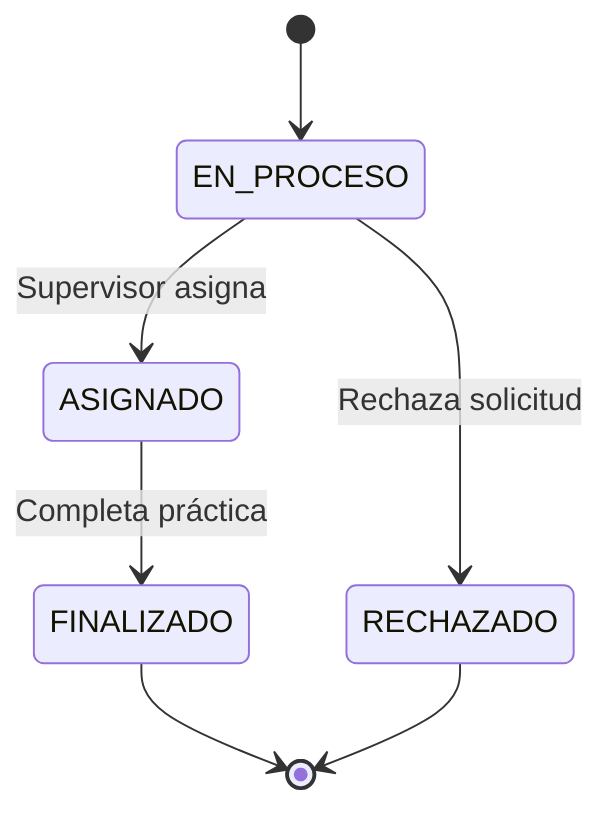
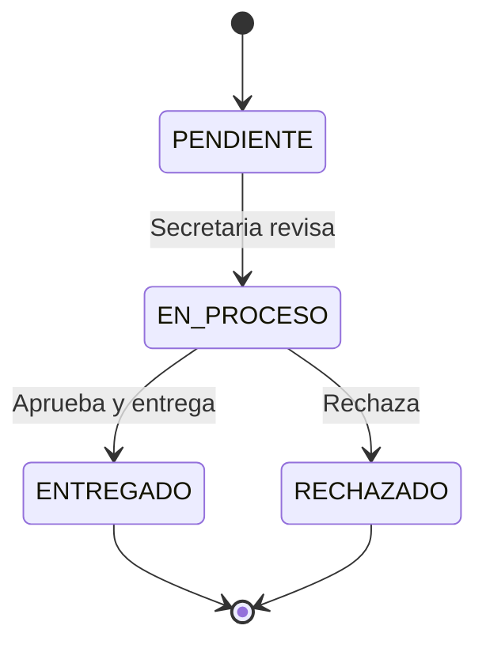
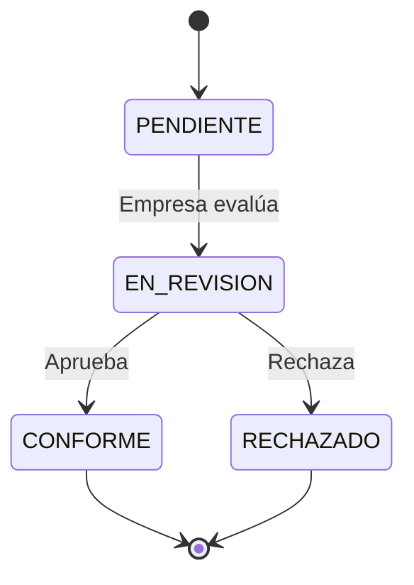

# Desarrollo de un Sistema Web para las Prácticas Pre Profesionales del área de FIA para la UPeU - Arquitectura y Diseño del Sistema

**Versión:** 1.0  
**Fecha:** Noviembre 2025  
**Autor:** Equipo de Desarrollo PPP-UPeU

---

## Índice

1. [Documento de Arquitectura C4 o Equivalente](#1-documento-de-arquitectura-c4-o-equivalente)
   - 1.1 [Contexto del Sistema](#11-contexto-del-sistema)
   - 1.2 [Problemática y Justificación](#12-problemática-y-justificación)
   - 1.3 [Objetivos del Sistema](#13-objetivos-del-sistema)
   - 1.4 [Alcance](#14-alcance)
   - 1.5 [Arquitectura C4 - Nivel 1: Contexto](#15-arquitectura-c4---nivel-1-contexto)
   - 1.6 [Arquitectura C4 - Nivel 2: Contenedores](#16-arquitectura-c4---nivel-2-contenedores)
   - 1.7 [Arquitectura C4 - Nivel 3: Componentes](#17-arquitectura-c4---nivel-3-componentes)

2. [Diagrama de Entidades / Estados](#2-diagrama-de-entidades--estados)
   - 2.1 [Dominio Académico](#21-dominio-académico)
   - 2.2 [Dominio Empresarial](#22-dominio-empresarial)
   - 2.3 [Dominio de Prácticas y Evaluaciones](#23-dominio-de-prácticas-y-evaluaciones)

3. [Diagrama de Clases](#3-diagrama-de-clases)
   - 3.1 [Estructura General](#31-estructura-general)
   - 3.2 [Patrones de Diseño Aplicados](#32-patrones-de-diseño-aplicados)

4. [Diagrama de Secuencia y Otros Diagramas Complementarios](#4-diagrama-de-secuencia-y-otros-diagramas-complementarios)
   - 4.1 [Secuencia de Escenarios Clave](#41-secuencia-de-escenarios-clave)
   - 4.2 [Diagramas Complementarios](#42-diagramas-complementarios)

5. [Decisiones de Arquitectura](#5-decisiones-de-arquitectura)
   - 5.1 [Justificación de Microservicios](#51-justificación-de-microservicios)
   - 5.2 [Stack Tecnológico](#52-stack-tecnológico)
   - 5.3 [Patrones Arquitectónicos](#53-patrones-arquitectónicos)
   - 5.4 [Estrategia de Base de Datos](#54-estrategia-de-base-de-datos)

6. [Calidad y Atributos del Sistema](#6-calidad-y-atributos-del-sistema)
   - 6.1 [Escalabilidad](#61-escalabilidad)
   - 6.2 [Seguridad](#62-seguridad)
   - 6.3 [Mantenibilidad](#63-mantenibilidad)
   - 6.4 [Disponibilidad](#64-disponibilidad)

7. [Estrategia de Despliegue](#7-estrategia-de-despliegue)
   - 7.1 [Infraestructura Azure](#71-infraestructura-azure)
   - 7.2 [CI/CD](#72-cicd)
   - 7.3 [Monitoreo y Observabilidad](#73-monitoreo-y-observabilidad)

8. [Visión Futura y Roadmap](#8-visión-futura-y-roadmap)
   - 8.1 [Mejoras Planificadas](#81-mejoras-planificadas)
   - 8.2 [Escalabilidad Futura](#82-escalabilidad-futura)
   - 8.3 [Tecnologías Emergentes](#83-tecnologías-emergentes)

9. [Conclusiones](#9-conclusiones)

10. [Referencias](#10-referencias)

---

## 1. Documento de Arquitectura C4 o Equivalente

### 1.1 Contexto del Sistema

El Sistema de Gestión de Prácticas Pre-Profesionales (PPP) es una plataforma web diseñada para digitalizar y automatizar el proceso completo de gestión de prácticas pre-profesionales en la Facultad de Ingeniería y Arquitectura (FIA) de la Universidad Peruana Unión (UPeU).

#### Situación Actual

Actualmente, la gestión de prácticas pre-profesionales se realiza mediante procesos manuales que involucran:
- Documentación física (cartas de presentación, solicitudes)
- Seguimiento manual de estados por parte de secretarias
- Evaluaciones en papel
- Falta de trazabilidad en tiempo real
- Dificultad para generar reportes y estadísticas

#### Usuarios del Sistema

El sistema atiende a múltiples actores con necesidades específicas:

| Actor | Rol | Responsabilidades en el Sistema |
|-------|-----|--------------------------------|
| **Alumno** | Practicante | Solicitar prácticas, subir documentos, consultar estado |
| **Supervisor** | Docente | Evaluar alumnos, aprobar solicitudes, realizar seguimiento |
| **Secretaria** | Administrativa | Generar cartas de presentación, validar documentos |
| **Coordinador** | Académico | Gestionar líneas académicas, supervisar prácticas, reportes |
| **Empresa** | Externa | Consultar solicitudes, evaluar practicantes |

### 1.2 Problemática y Justificación

#### Problemas Identificados

1. **Ineficiencia Operacional**
   - Tiempo excesivo en tramitación de documentos
   - Duplicidad de información
   - Errores en documentación manual

2. **Falta de Trazabilidad**
   - Dificultad para conocer el estado de solicitudes
   - Pérdida de documentos
   - Falta de historial de cambios

3. **Comunicación Fragmentada**
   - Coordinación deficiente entre actores
   - Notificaciones no automatizadas
   - Información dispersa

4. **Dificultad en Gestión**
   - Generación manual de reportes
   - Falta de indicadores en tiempo real
   - Proceso de evaluación desorganizado

#### Justificación de la Solución

La implementación de un sistema web integral permite:

✅ **Automatización** de procesos repetitivos  
✅ **Centralización** de información  
✅ **Trazabilidad** completa del flujo de trabajo  
✅ **Escalabilidad** para crecimiento futuro  
✅ **Mejora en tiempos** de respuesta  
✅ **Reducción de errores** humanos  

### 1.3 Objetivos del Sistema

#### Objetivos Generales

- Digitalizar el proceso completo de gestión de prácticas pre-profesionales
- Mejorar la eficiencia operativa del área de FIA
- Proporcionar visibilidad en tiempo real del estado de solicitudes

#### Objetivos Específicos

1. **Gestión de Solicitudes**: Permitir la creación, seguimiento y aprobación de solicitudes de prácticas
2. **Generación Automatizada**: Crear cartas de presentación y documentos de manera automática
3. **Evaluación Digital**: Facilitar evaluaciones de supervisores y empresas
4. **Reportería**: Generar estadísticas e indicadores de gestión
5. **Notificaciones**: Alertar automáticamente sobre cambios de estado
6. **Trazabilidad**: Mantener historial completo de todas las operaciones

### 1.4 Alcance

#### Dentro del Alcance

✅ Gestión de usuarios (alumnos, supervisores, secretarias, coordinadores)  
✅ Registro y gestión de empresas  
✅ Solicitudes de prácticas con flujo de estados  
✅ Generación de cartas de presentación  
✅ Gestión de documentos (subida, descarga, validación)  
✅ Evaluaciones de supervisor y practicante  
✅ Reportes básicos y estadísticas  
✅ Notificaciones por email  
✅ Dashboard para diferentes roles  

#### Fuera del Alcance (Fase Inicial)

❌ Integración con sistemas académicos existentes (SISGESA)  
❌ Firma digital de documentos  
❌ Pagos o transacciones financieras  
❌ Aplicación móvil nativa  
❌ Videoconferencias integradas  

### 1.5 Arquitectura C4 - Nivel 1: Contexto

El **Nivel 1 - Contexto** muestra el sistema como una caja negra y su relación con actores externos:

```
                    ┌─────────────────────────────────┐
                    │                                 │
   ┌────────────┐   │                                 │   ┌────────────────┐
   │  Alumno    │───┤                                 │   │  Azure         │
   └────────────┘   │                                 │   │  Storage       │
                    │                                 │   │  (Documentos)  │
   ┌────────────┐   │      ┌─────────────────┐       │   └────────────────┘
   │ Supervisor │───┤      │                 │       │            │
   └────────────┘   │      │  Sistema PPP    │───────┼────────────┘
                    │      │  (Gestión de    │       │
   ┌────────────┐   │      │   Prácticas)    │       │   ┌────────────────┐
   │ Secretaria │───┼─────▶│                 │───────┼──▶│  Email Service │
   └────────────┘   │      └─────────────────┘       │   │     (SMTP)     │
                    │              │                  │   └────────────────┘
   ┌────────────┐   │              │                  │
   │Coordinador │───┤              │                  │
   └────────────┘   │              │                  │
                    │              ▼                  │
   ┌────────────┐   │      ┌─────────────────┐       │
   │  Empresa   │───┤      │ Azure PostgreSQL│       │
   └────────────┘   │      │   (Databases)   │       │
                    │      └─────────────────┘       │
                    │                                 │
                    └─────────────────────────────────┘
```

**Ver diagrama UML completo:** [`docs/diagramas/01a-c4-nivel1-contexto.puml`](./diagramas/01a-c4-nivel1-contexto.puml)

#### Descripción del Contexto

El **Sistema PPP** es una aplicación web que permite a los usuarios de la Universidad gestionar todo el ciclo de vida de las prácticas pre-profesionales:

- **Actores Humanos**: Alumnos, Supervisores, Secretarias, Coordinadores, Empresas
- **Sistemas Externos**: 
  - **Azure Storage**: Almacenamiento de documentos PDF y archivos
  - **Email Service (SMTP)**: Notificaciones automáticas
  - **Azure PostgreSQL**: Persistencia de datos

**Propósito**: Vista de alto nivel para stakeholders no técnicos que muestra qué hace el sistema y con quién interactúa.

### 1.6 Arquitectura C4 - Nivel 2: Contenedores

El **Nivel 2 - Contenedores** muestra la arquitectura interna del Sistema PPP, revelando los microservicios que lo componen:

```
┌─────────────────────────────────────────────────────────────────────────┐
│                          SISTEMA PPP                                    │
├─────────────────────────────────────────────────────────────────────────┤
│                                                                         │
│    ┌──────────────────────────────────────────────────────┐            │
│    │         API Gateway (NestJS - Puerto 3000)           │            │
│    │  - Enrutamiento HTTP                                 │            │
│    │  - Autenticación JWT                                 │            │
│    │  - Rate Limiting                                     │            │
│    │  - CORS                                              │            │
│    └──────────────────────────────────────────────────────┘            │
│           │           │           │           │                         │
│           ▼           ▼           ▼           ▼                         │
│    ┌──────────┐ ┌──────────┐ ┌──────────┐ ┌──────────┐                │
│    │   Auth   │ │   Core   │ │Compañías │ │Evaluacio-│                │
│    │ Service  │ │ Service  │ │ Service  │ │   nes    │                │
│    │  :3001   │ │  :3002   │ │  :3003   │ │ Service  │                │
│    │          │ │          │ │          │ │  :3004   │                │
│    │ NestJS   │ │ NestJS   │ │ NestJS   │ │ NestJS   │                │
│    │ Prisma   │ │ Prisma   │ │ Prisma   │ │ Prisma   │                │
│    └──────────┘ └──────────┘ └──────────┘ └──────────┘                │
│         │            │            │            │                        │
│         ▼            ▼            ▼            ▼                        │
│    ┌──────────┐ ┌──────────┐ ┌──────────┐ ┌──────────┐                │
│    │ ppp_auth │ │ ppp_core │ │ppp_compa-│ │ppp_evalua│                │
│    │    DB    │ │    DB    │ │  nias DB │ │ ciones DB│                │
│    │PostgreSQL│ │PostgreSQL│ │PostgreSQL│ │PostgreSQL│                │
│    └──────────┘ └──────────┘ └──────────┘ └──────────┘                │
│                                                                         │
└─────────────────────────────────────────────────────────────────────────┘
           │                           │
           ▼                           ▼
  ┌─────────────────┐         ┌─────────────────┐
  │  Azure Storage  │         │  Email Service  │
  │    (Blobs)      │         │     (SMTP)      │
  └─────────────────┘         └─────────────────┘
```

**Ver diagrama UML completo:** [`docs/diagramas/01b-c4-nivel2-contenedores.puml`](./diagramas/01b-c4-nivel2-contenedores.puml)

#### Descripción de Contenedores

| Contenedor | Tecnología | Responsabilidad | Base de Datos | Puerto |
|------------|-----------|----------------|---------------|--------|
| **API Gateway** | NestJS, Node.js 20 | Punto de entrada único, enrutamiento, autenticación | - | 3000 |
| **Auth Service** | NestJS, Prisma, JWT | Usuarios, roles, privilegios, autenticación | `ppp_auth` | 3001 |
| **Core Service** | NestJS, Prisma | Facultades, escuelas, líneas, datos académicos | `ppp_core` | 3002 |
| **Compañías Service** | NestJS, Prisma, Azure SDK | Empresas, solicitudes, documentos, reuniones | `ppp_companias` | 3003 |
| **Evaluaciones Service** | NestJS, Prisma | Evaluaciones, preguntas, dimensiones | `ppp_evaluaciones` | 3004 |

#### Comunicación entre Contenedores

- **Cliente ↔ API Gateway**: HTTPS/REST (puerto 443 en producción)
- **API Gateway ↔ Microservicios**: HTTP/REST (red interna)
- **Microservicios ↔ Bases de Datos**: PostgreSQL Protocol (puerto 5432)
- **Compañías Service ↔ Azure Storage**: Azure SDK/HTTPS
- **Servicios ↔ Email**: SMTP (puerto 587)

**Propósito**: Vista técnica para arquitectos y desarrolladores que muestra la distribución de responsabilidades y dependencias entre contenedores.

### 1.7 Arquitectura C4 - Nivel 3: Componentes

Cada microservicio sigue una arquitectura modular basada en NestJS:

```
┌─────────────────────────────────────────┐
│         Microservicio (NestJS)          │
├─────────────────────────────────────────┤
│  Controllers                            │
│  ├── HTTP Endpoints (REST)              │
│  └── DTOs de entrada/salida             │
├─────────────────────────────────────────┤
│  Services (Lógica de Negocio)           │
│  ├── Validaciones                       │
│  ├── Transformaciones                   │
│  └── Orquestación                       │
├─────────────────────────────────────────┤
│  Repositories / Prisma Client           │
│  ├── Acceso a datos                     │
│  └── Queries optimizadas                │
├─────────────────────────────────────────┤
│  Guards & Middlewares                   │
│  ├── Autenticación JWT                  │
│  └── Autorización por roles             │
└─────────────────────────────────────────┘
```

**Ver diagrama completo:** [`docs/diagramas/02-componentes-microservicios.puml`](./diagramas/02-componentes-microservicios.puml)

---

## 2. Diagrama de Entidades / Estados

### 2.1 Dominio Académico

El dominio académico gestiona la estructura organizacional de la universidad:

#### Entidades Principales

- **Facultad**: Representa las facultades de la universidad
- **Escuela**: Escuelas profesionales asociadas a facultades
- **LineaFacultad**: Líneas de investigación o especialización
- **Alumno**: Estudiantes matriculados
- **Supervisor**: Docentes supervisores
- **Secretaria**: Personal administrativo
- **Coordinador**: Coordinadores de prácticas

#### Relaciones

```
Facultad (1) ──< Escuela (N)
Escuela (1) ──< LineaFacultad (N)
Escuela (1) ──< Alumno (N)
Escuela (1) ──< Supervisor (N)
Escuela (1) ──< Secretaria (N)
Escuela (1) ──< Coordinador (N)
```

**Ver diagrama completo:** [`docs/diagramas/03-entidades-dominio-academico.puml`](./diagramas/03-entidades-dominio-academico.puml)

#### Estados de Entidades

- **Facultad/Escuela**: `activo` | `inactivo`
- **Usuario Especializado**: Todos los usuarios especializados heredan del usuario base en Auth Service

### 2.2 Dominio Empresarial

Gestiona empresas, solicitudes y documentación relacionada:

#### Entidades Principales

- **Empresa**: Organizaciones que ofrecen prácticas
- **SolicitudPpp**: Solicitudes de prácticas de alumnos
- **CartaPresentacion**: Cartas generadas para presentar alumnos
- **Documento**: Archivos relacionados con solicitudes
- **TipoDocumento**: Clasificación de documentos
- **Reunion**: Reuniones programadas

**Ver diagrama completo:** [`docs/diagramas/04-entidades-dominio-empresarial.puml`](./diagramas/04-entidades-dominio-empresarial.puml)

#### Estados de SolicitudPpp



| Estado | Código | Descripción |
|--------|--------|-------------|
| EN_PROCESO | 0 | Solicitud creada, pendiente de asignación |
| ASIGNADO | 1 | Supervisor asignado, práctica en curso |
| FINALIZADO | 5 | Práctica completada exitosamente |
| RECHAZADO | 99 | Solicitud rechazada |

#### Estados de CartaPresentacion



| Estado | Código | Descripción |
|--------|--------|-------------|
| PENDIENTE | 0 | Carta solicitada |
| EN_PROCESO | 1 | Secretaria revisando |
| ENTREGADO | 5 | Carta aprobada y entregada |
| RECHAZADO | 99 | Carta rechazada |

### 2.3 Dominio de Prácticas y Evaluaciones

Gestiona las evaluaciones de supervisores y empresas:

#### Entidades Principales

- **EvaluacionSupervisor**: Evaluación del supervisor al alumno
- **EvaluacionPracticante**: Evaluación de la empresa al practicante
- **Pregunta**: Banco de preguntas genéricas
- **PreguntaLinea**: Preguntas específicas por línea académica
- **DimensionTransversal**: Competencias genéricas evaluadas
- **EvaluacionPregunta**: Respuestas a preguntas

**Ver diagrama completo:** [`docs/diagramas/05-entidades-dominio-practicas-evaluaciones.puml`](./diagramas/05-entidades-dominio-practicas-evaluaciones.puml)

#### Estados de EvaluacionSupervisor

| Estado | Código | Descripción |
|--------|--------|-------------|
| PENDIENTE | 0 | Evaluación no iniciada |
| EVALUADO | 5 | Evaluación completada |

#### Estados de EvaluacionPracticante



| Estado | Código | Descripción |
|--------|--------|-------------|
| PENDIENTE | 0 | Sin evaluar |
| EN_REVISION | 1 | Empresa revisando |
| CONFORME | 5 | Evaluación aprobada |
| RECHAZADO | 99 | Evaluación rechazada |

---

## 3. Diagrama de Clases

### 3.1 Estructura General

El sistema implementa una arquitectura orientada a objetos siguiendo principios SOLID:

**Ver diagrama completo:** [`docs/diagramas/06-diagrama-clases-principal.puml`](./diagramas/06-diagrama-clases-principal.puml)

#### Jerarquía de Clases

```
Usuario (Clase Base)
    │
    ├── Alumno
    ├── Supervisor
    ├── Secretaria
    └── Coordinador
```

Todos los usuarios especializados heredan de `UsuarioEspecializado`, que a su vez está vinculado con `Usuario` del Auth Service.

### 3.2 Patrones de Diseño Aplicados

#### 1. **Repository Pattern**

Cada entidad tiene su repositorio que abstrae el acceso a datos:

```typescript
// Ejemplo conceptual
interface IRepository<T> {
  findAll(): Promise<T[]>;
  findById(id: string): Promise<T>;
  create(data: Partial<T>): Promise<T>;
  update(id: string, data: Partial<T>): Promise<T>;
  delete(id: string): Promise<void>;
}
```

#### 2. **Dependency Injection**

NestJS proporciona inyección de dependencias nativa:

```typescript
@Injectable()
export class SolicitudService {
  constructor(
    private readonly prisma: PrismaService,
    private readonly empresaService: EmpresaService
  ) {}
}
```

#### 3. **DTO (Data Transfer Object)**

Validación y transferencia de datos:

```typescript
export class CreateSolicitudDto {
  @IsUUID()
  idAlumno: string;
  
  @IsUUID()
  idEmpresa: string;
  
  @IsDateString()
  fechaInicio: string;
}
```

#### 4. **Guard Pattern**

Protección de rutas con autenticación y autorización:

```typescript
@UseGuards(JwtAuthGuard, RolesGuard)
@Roles('SUPERVISOR', 'COORDINADOR')
@Get('solicitudes')
async getSolicitudes() { }
```

#### 5. **Factory Pattern**

Generación de documentos y reportes:

```typescript
class DocumentFactory {
  static create(tipo: TipoDocumento) {
    switch(tipo) {
      case 'CARTA': return new CartaPresentacion();
      case 'INFORME': return new InformeFinal();
    }
  }
}
```

---

## 4. Diagrama de Secuencia y Otros Diagramas Complementarios

### 4.1 Secuencia de Escenarios Clave

#### Escenario 1: Creación de Solicitud de Práctica

**Ver diagrama:** [`docs/diagramas/07-secuencia-crear-solicitud.puml`](./diagramas/07-secuencia-crear-solicitud.puml)

#### Escenario 2: Generación de Carta de Presentación

**Ver diagrama:** [`docs/diagramas/08-secuencia-carta-presentacion.puml`](./diagramas/08-secuencia-carta-presentacion.puml)

#### Escenario 3: Evaluación de Supervisor

**Ver diagrama:** [`docs/diagramas/09-secuencia-evaluacion-supervisor.puml`](./diagramas/09-secuencia-evaluacion-supervisor.puml)

#### Escenario 4: Autenticación y Autorización

**Ver diagrama:** [`docs/diagramas/10-secuencia-autenticacion.puml`](./diagramas/10-secuencia-autenticacion.puml)

### 4.2 Diagramas Complementarios

#### Diagrama de Despliegue

**Ver diagrama:** [`docs/diagramas/11-diagrama-despliegue.puml`](./diagramas/11-diagrama-despliegue.puml)

#### Diagrama de Estados Completo

**Ver diagrama:** [`docs/diagramas/12-diagrama-estados-completo.puml`](./diagramas/12-diagrama-estados-completo.puml)

---

## 5. Decisiones de Arquitectura

### 5.1 Justificación de Microservicios

#### ¿Por qué Microservicios?

La decisión de adoptar una arquitectura de microservicios se basa en los siguientes criterios:

##### 1. **Separación de Dominios**

El sistema tiene dominios claramente diferenciados:
- **Autenticación**: Gestión de usuarios y permisos (transversal)
- **Académico**: Estructura universitaria (bajo cambio)
- **Empresarial**: Solicitudes y documentos (alto cambio)
- **Evaluaciones**: Sistema de evaluaciones (alto cambio)

##### 2. **Escalabilidad Independiente**

Cada microservicio puede escalar según demanda:

```
Evaluaciones Service (Alta demanda en períodos de evaluación)
    ↑↑↑↑ Escala a 5 instancias

Core Service (Baja demanda, datos estables)
    ↑ Mantiene 1 instancia
```

##### 3. **Desarrollo Paralelo**

Equipos pueden trabajar simultáneamente:
- Equipo A: Auth + Core
- Equipo B: Compañías
- Equipo C: Evaluaciones

##### 4. **Despliegue Independiente**

```
Cambio en Evaluaciones → Deploy solo ese servicio
✅ Otros servicios no se ven afectados
✅ Menor riesgo
✅ Deploy más rápido
```

##### 5. **Resiliencia**

Si un servicio falla, los demás continúan operando:

```
❌ Evaluaciones Service caído
✅ Alumnos pueden seguir creando solicitudes
✅ Secretarias pueden generar cartas
✅ Sistema degradado, no caído completamente
```

#### Comparación con Monolito

| Aspecto | Monolito | Microservicios | Decisión |
|---------|----------|----------------|----------|
| **Complejidad Inicial** | Baja | Alta | ⚠️ Aceptable |
| **Escalabilidad** | Todo o nada | Por servicio | ✅ Necesario |
| **Desarrollo Paralelo** | Difícil | Fácil | ✅ Ventaja |
| **Deploy** | Todo junto | Independiente | ✅ Crítico |
| **Mantenimiento** | Simple | Complejo | ⚠️ Manejable |
| **Resiliencia** | Punto único de fallo | Aislado | ✅ Importante |

**Conclusión**: La arquitectura de microservicios se justifica por la necesidad de escalabilidad, desarrollo paralelo y resiliencia, a pesar de la mayor complejidad inicial.

### 5.2 Stack Tecnológico

#### Backend

| Tecnología | Versión | Justificación |
|------------|---------|---------------|
| **Node.js** | 20 LTS | Runtime estable, alto rendimiento, ecosistema maduro |
| **NestJS** | 10.x | Framework enterprise, soporte TypeScript nativo, arquitectura modular |
| **TypeScript** | 5.x | Tipado estático, mejor mantenibilidad, menos errores en runtime |
| **Prisma ORM** | 5.x | Type-safe, migraciones automáticas, excelente DX |
| **PostgreSQL** | 14+ | Base de datos robusta, ACID, soporte JSON, relacional |
| **JWT** | - | Estándar industria para autenticación stateless |
| **Passport.js** | - | Estrategias de autenticación modulares |

#### Frontend (Recomendado)

| Tecnología | Justificación |
|------------|---------------|
| **React** o **Angular** | Componentes reutilizables, ecosistema maduro |
| **TypeScript** | Consistencia con backend |
| **TailwindCSS** | Desarrollo rápido de UI |
| **React Query** o **TanStack** | Gestión de estado servidor |

#### Infraestructura

| Servicio | Proveedor | Justificación |
|----------|-----------|---------------|
| **App Services** | Azure | Despliegue fácil de Node.js, escalado automático |
| **PostgreSQL** | Azure Database | Managed service, backups automáticos, alta disponibilidad |
| **Blob Storage** | Azure | Almacenamiento escalable para documentos |
| **Container Registry** | Azure (ACR) | Versionado de imágenes Docker |
| **Application Insights** | Azure | Monitoreo y telemetría |

#### DevOps

| Herramienta | Uso |
|-------------|-----|
| **Docker** | Containerización de microservicios |
| **Docker Compose** | Desarrollo local |
| **GitHub Actions** | CI/CD pipelines |
| **ESLint + Prettier** | Calidad de código |
| **Jest** | Testing unitario |

### 5.3 Patrones Arquitectónicos

#### 1. **API Gateway Pattern**

Punto de entrada único para todos los clientes:

```
Cliente → API Gateway → [Auth, Core, Compañías, Evaluaciones]
```

**Ventajas**:
- Autenticación centralizada
- Rate limiting
- Enrutamiento inteligente
- Versionado de API
- Logging centralizado

#### 2. **Database per Service**

Cada microservicio tiene su propia base de datos:

```
Auth Service → ppp_auth
Core Service → ppp_core
Compañías Service → ppp_companias
Evaluaciones Service → ppp_evaluaciones
```

**Ventajas**:
- Desacoplamiento total
- Optimización independiente
- Cambios de esquema sin afectar otros servicios

**Desafíos**:
- Joins distribuidos (se evitan mediante desnormalización controlada)
- Transacciones distribuidas (se usan sagas cuando es necesario)

#### 3. **CQRS (Command Query Responsibility Segregation) - Ligero**

Separación de lectura y escritura a nivel de servicio:

```typescript
// Escritura
createSolicitud(data: CreateSolicitudDto)

// Lectura optimizada
getSolicitudesWithEmpresa() // Query con joins
```

#### 4. **Event-Driven (Futuro)**

Comunicación asíncrona entre microservicios:

```
SolicitudCreated → [EmailService, NotificationService]
```

Actualmente se usa HTTP síncrono, pero la arquitectura permite migrar a eventos.

### 5.4 Estrategia de Base de Datos

#### Separación de Bases de Datos

```
┌─────────────┐     ┌─────────────┐     ┌─────────────┐
│  ppp_auth   │     │  ppp_core   │     │ppp_companias│
├─────────────┤     ├─────────────┤     ├─────────────┤
│ Usuario     │     │ Facultad    │     │ Empresa     │
│ Rol         │     │ Escuela     │     │ Solicitud   │
│ Alumno      │     │ Linea       │     │ Documento   │
└─────────────┘     └─────────────┘     └─────────────┘
```

#### Referencias Cruzadas

Se manejan mediante **IDs externos** (UUID) sin foreign keys entre bases de datos:

```typescript
// En Compañías Service
class SolicitudPpp {
  idAlumno: UUID; // Referencia a ppp_auth.alumno (sin FK)
  idSupervisor: UUID; // Referencia a ppp_auth.supervisor (sin FK)
}
```

**Validación** de referencias se hace mediante llamadas HTTP entre servicios cuando es crítico.

#### Migraciones

Cada servicio gestiona sus propias migraciones con Prisma:

```bash
# Generar migración
npx prisma migrate dev --name add_reunion_table

# Aplicar en producción
npx prisma migrate deploy
```

---

## 6. Calidad y Atributos del Sistema

### 6.1 Escalabilidad

#### Escalabilidad Horizontal

Cada microservicio puede replicarse:

```
┌──────────────────────────────────────┐
│         Load Balancer (Azure)        │
└──────────────────────────────────────┘
         │          │          │
         ▼          ▼          ▼
    ┌────────┐ ┌────────┐ ┌────────┐
    │Service │ │Service │ │Service │
    │  #1    │ │  #2    │ │  #3    │
    └────────┘ └────────┘ └────────┘
```

#### Escalabilidad de Base de Datos

- **Read Replicas**: Para consultas pesadas
- **Connection Pooling**: Prisma gestiona pool de conexiones
- **Índices**: Optimización de queries frecuentes

#### Capacidad Estimada

| Métrica | Valor Actual | Escalable a |
|---------|--------------|-------------|
| Usuarios concurrentes | 100 | 10,000+ |
| Solicitudes/día | 1,000 | 100,000+ |
| Almacenamiento documentos | 10 GB | Ilimitado (Azure Blob) |
| Tiempo de respuesta API | < 200ms | < 500ms bajo carga |

### 6.2 Seguridad

#### Autenticación

- **JWT** con expiración configurable (default: 24h)
- **Refresh Tokens** para sesiones largas
- **Password Hashing**: bcrypt con salt rounds = 10

```typescript
const hashedPassword = await bcrypt.hash(password, 10);
```

#### Autorización

- **Role-Based Access Control (RBAC)**
- **Guards** en cada endpoint

```typescript
@UseGuards(JwtAuthGuard, RolesGuard)
@Roles('COORDINADOR')
@Get('reportes')
```

#### Seguridad de Datos

- **Validación** de entrada con class-validator
- **Sanitización** de datos
- **SQL Injection**: Prevenido por Prisma ORM
- **XSS**: Validación y escape de HTML
- **CORS**: Configurado para dominios específicos

```typescript
app.enableCors({
  origin: process.env.ALLOWED_ORIGINS.split(','),
  credentials: true
});
```

#### Comunicación

- **HTTPS** obligatorio en producción
- **Headers de seguridad**: Helmet.js

```typescript
app.use(helmet());
```

### 6.3 Mantenibilidad

#### Código Limpio

- **TypeScript** para tipado estático
- **ESLint** + **Prettier** configurados
- **Convenciones de nombrado** consistentes
- **Comentarios** en lógica compleja

#### Documentación

- **Swagger/OpenAPI** para cada microservicio
- **Comentarios JSDoc** en código
- **README** en cada servicio
- **Diagramas UML** (este documento)

#### Testing

```
tests/
├── unit/          # Tests unitarios
├── integration/   # Tests de integración
└── e2e/          # Tests end-to-end
```

**Cobertura objetivo**: > 70%

#### Logging

```typescript
logger.info('Solicitud creada', { 
  solicitudId, 
  alumnoId, 
  empresaId 
});
```

Logs centralizados en Azure Application Insights.

### 6.4 Disponibilidad

#### Objetivos

- **SLA Target**: 99.5% uptime
- **RTO (Recovery Time Objective)**: < 1 hora
- **RPO (Recovery Point Objective)**: < 15 minutos

#### Estrategias

1. **Health Checks**: Endpoint `/health` en cada servicio
2. **Circuit Breaker**: Prevención de cascading failures
3. **Retry Logic**: Reintentos automáticos con backoff exponencial
4. **Backups**: Diarios automáticos de PostgreSQL
5. **Disaster Recovery**: Snapshots de bases de datos

---

## 7. Estrategia de Despliegue

### 7.1 Infraestructura Azure

#### Arquitectura de Despliegue

```
┌─────────────────────────────────────────────┐
│         Azure App Service Plan              │
│  ┌────────┐  ┌────────┐  ┌────────┐        │
│  │Gateway │  │  Auth  │  │  Core  │        │
│  │  :3000 │  │ :3001  │  │ :3002  │        │
│  └────────┘  └────────┘  └────────┘        │
│  ┌────────┐  ┌────────┐                     │
│  │Compañías│ │Evaluac.│                     │
│  │ :3003  │  │ :3004  │                     │
│  └────────┘  └────────┘                     │
└─────────────────────────────────────────────┘
         │                    │
         ▼                    ▼
┌─────────────────┐   ┌─────────────────┐
│ Azure PostgreSQL│   │  Azure Blob     │
│   (4 databases) │   │   Storage       │
└─────────────────┘   └─────────────────┘
```

#### Recursos Azure

| Recurso | SKU/Tier | Justificación |
|---------|----------|---------------|
| App Service Plan | B2 (Basic) | Desarrollo; P1V2 (Premium) para producción |
| PostgreSQL | B_Gen5_2 | 2 vCores, suficiente para inicio |
| Blob Storage | Hot tier | Acceso frecuente a documentos |
| Application Insights | Standard | Monitoreo y diagnóstico |

### 7.2 CI/CD

#### Pipeline GitHub Actions

```yaml
# .github/workflows/deploy-auth-service.yml
name: Deploy Auth Service

on:
  push:
    branches: [main]
    paths:
      - 'apps/ppp-auth-service/**'

jobs:
  build-and-deploy:
    runs-on: ubuntu-latest
    steps:
      - uses: actions/checkout@v2
      
      - name: Build Docker Image
        run: docker build -t auth-service .
        
      - name: Push to ACR
        run: |
          docker tag auth-service $ACR_NAME.azurecr.io/auth-service:${{ github.sha }}
          docker push $ACR_NAME.azurecr.io/auth-service:${{ github.sha }}
      
      - name: Deploy to Azure App Service
        uses: azure/webapps-deploy@v2
        with:
          app-name: ppp-auth-service
          images: $ACR_NAME.azurecr.io/auth-service:${{ github.sha }}
```

#### Estrategia de Branching

```
main (producción)
  │
  ├─ develop (desarrollo)
  │   ├─ feature/nueva-funcionalidad
  │   └─ fix/bug-solicitudes
  │
  └─ hotfix/critical-fix
```

#### Ambientes

| Ambiente | Branch | URL Base |
|----------|--------|----------|
| **Desarrollo** | develop | `https://dev-api.ppp.upeu.edu.pe` |
| **Staging** | staging | `https://staging-api.ppp.upeu.edu.pe` |
| **Producción** | main | `https://api.ppp.upeu.edu.pe` |

### 7.3 Monitoreo y Observabilidad

#### Application Insights

```typescript
// Telemetría custom
const { TelemetryClient } = require('applicationinsights');
const client = new TelemetryClient(instrumentationKey);

client.trackEvent({
  name: 'SolicitudCreated',
  properties: { alumnoId, empresaId }
});
```

#### Métricas Clave (KPIs)

| Métrica | Objetivo | Alerta |
|---------|----------|--------|
| Tiempo de respuesta API | < 200ms | > 1s |
| Tasa de error | < 1% | > 5% |
| Disponibilidad | > 99.5% | < 99% |
| CPU utilization | < 70% | > 90% |
| Memoria utilization | < 80% | > 95% |

#### Dashboards

- **Operaciones**: Requests/min, errores, latencia
- **Negocio**: Solicitudes creadas, cartas generadas, evaluaciones completadas
- **Infraestructura**: CPU, memoria, disco, conexiones DB

---

## 8. Visión Futura y Roadmap

### 8.1 Mejoras Planificadas

#### Corto Plazo (3-6 meses)

- [ ] **Aplicación móvil** (React Native)
- [ ] **Notificaciones push** en tiempo real
- [ ] **Firma digital** de documentos
- [ ] **Dashboard analytics** avanzado
- [ ] **Exportación** de reportes (Excel, PDF)

#### Mediano Plazo (6-12 meses)

- [ ] **Integración con SISGESA** (sistema académico UPeU)
- [ ] **Machine Learning** para asignación inteligente de supervisores
- [ ] **Chatbot** para preguntas frecuentes
- [ ] **Video-conferencias** integradas
- [ ] **Workflow engine** configurable

#### Largo Plazo (12+ meses)

- [ ] **Multi-tenancy**: Adaptar para otras facultades
- [ ] **Marketplace** de empresas
- [ ] **Sistema de recomendaciones** basado en perfil
- [ ] **Blockchain** para certificados inmutables

### 8.2 Escalabilidad Futura

#### Migración a Kubernetes

Cuando el sistema crezca, migrar de App Services a AKS:

```yaml
# Ejemplo: Kubernetes Deployment
apiVersion: apps/v1
kind: Deployment
metadata:
  name: auth-service
spec:
  replicas: 3
  selector:
    matchLabels:
      app: auth-service
  template:
    spec:
      containers:
      - name: auth
        image: acr.azurecr.io/auth-service:latest
        resources:
          limits:
            cpu: "500m"
            memory: "512Mi"
```

**Ventajas**:
- Auto-scaling más granular
- Service mesh (Istio/Linkerd)
- Mejor observabilidad
- Multi-cloud ready

#### Event-Driven Architecture

Introducir message broker (Azure Service Bus o RabbitMQ):

```
SolicitudService → [SolicitudCreatedEvent] → Queue
                                              ↓
                                    ┌─────────┼─────────┐
                                    ▼         ▼         ▼
                            EmailService  NotificationService  AnalyticsService
```

**Beneficios**:
- Desacoplamiento total
- Procesamiento asíncrono
- Resiliencia mejorada
- Escalado independiente de consumers

#### CQRS Completo

Separar base de datos de lectura y escritura:

```
Write Model (PostgreSQL) → Sync → Read Model (ElasticSearch/MongoDB)
                                    ↑
                                    └── Queries optimizadas
```

### 8.3 Tecnologías Emergentes

#### Potenciales Adopciones

| Tecnología | Caso de Uso | Prioridad |
|------------|-------------|-----------|
| **GraphQL** | API flexible para frontend | Media |
| **gRPC** | Comunicación inter-servicios | Alta |
| **Redis** | Cache distribuido | Alta |
| **Kafka** | Event streaming | Media |
| **ElasticSearch** | Búsqueda avanzada | Media |
| **Temporal.io** | Workflow orchestration | Baja |

---

## 9. Conclusiones

### Logros de la Arquitectura

✅ **Modularidad**: Sistema dividido en dominios claros y cohesivos  
✅ **Escalabilidad**: Arquitectura preparada para crecimiento  
✅ **Mantenibilidad**: Código organizado, documentado y testeable  
✅ **Seguridad**: Implementación de mejores prácticas  
✅ **Resiliencia**: Aislamiento de fallos entre servicios  
✅ **Flexibilidad**: Facilita cambios y nuevas funcionalidades  

### Trade-offs Aceptados

⚠️ **Complejidad inicial** vs. Escalabilidad futura  
⚠️ **Overhead de red** (comunicación entre servicios) vs. Independencia  
⚠️ **Eventual consistency** en algunos casos vs. Disponibilidad  
⚠️ **Costos de infraestructura** vs. Resiliencia y disponibilidad  

### Lecciones Aprendidas

1. **Database per Service** es fundamental para verdadera independencia
2. **API Gateway** simplifica enormemente la gestión de microservicios
3. **TypeScript + Prisma** mejora significativamente la productividad
4. **Azure** ofrece excelentes servicios managed, reduciendo ops
5. **Documentación** desde el inicio ahorra tiempo a largo plazo

### Recomendaciones

Para equipos que quieran implementar una arquitectura similar:

1. **Empezar simple**: No sobre-arquitecturar desde el día 1
2. **Automatizar pronto**: CI/CD desde el inicio
3. **Monitorear todo**: Logs, métricas, trazas
4. **Documentar decisiones**: ADRs (Architecture Decision Records)
5. **Iterar constantemente**: La arquitectura evoluciona

---

## 10. Referencias

### Documentación Técnica

- [NestJS Documentation](https://docs.nestjs.com/)
- [Prisma Documentation](https://www.prisma.io/docs/)
- [Azure App Service](https://docs.microsoft.com/azure/app-service/)
- [PostgreSQL Documentation](https://www.postgresql.org/docs/)

### Patrones y Prácticas

- Martin Fowler - [Microservices Patterns](https://martinfowler.com/microservices/)
- Microsoft - [Cloud Design Patterns](https://docs.microsoft.com/azure/architecture/patterns/)
- Sam Newman - "Building Microservices"
- Chris Richardson - "Microservices Patterns"

### Estándares

- [OpenAPI Specification](https://swagger.io/specification/)
- [C4 Model](https://c4model.com/) para diagramas de arquitectura
- [The Twelve-Factor App](https://12factor.net/)
- [REST API Best Practices](https://restfulapi.net/)

### Herramientas

- [PlantUML](https://plantuml.com/) - Diagramas como código
- [Draw.io](https://app.diagrams.net/) - Diagramas visuales
- [Excalidraw](https://excalidraw.com/) - Wireframes rápidos

---

**Fin del Documento**

---

## Apéndices

### Apéndice A: Glosario

| Término | Definición |
|---------|------------|
| **PPP** | Prácticas Pre-Profesionales |
| **FIA** | Facultad de Ingeniería y Arquitectura |
| **UPeU** | Universidad Peruana Unión |
| **JWT** | JSON Web Token |
| **RBAC** | Role-Based Access Control |
| **DTO** | Data Transfer Object |
| **ORM** | Object-Relational Mapping |
| **CRUD** | Create, Read, Update, Delete |
| **API** | Application Programming Interface |
| **UUID** | Universally Unique Identifier |

### Apéndice B: Estructura de Proyecto

```
PNest_AzP/
├── apps/
│   ├── ppaz-api-gateway/
│   ├── ppp-auth-service/
│   ├── ppp_core/
│   ├── ppp_companias/
│   └── ppp-evaluaciones-service/
├── docs/
│   ├── diagramas/          # Diagramas UML PlantUML
│   └── ARQUITECTURA_Y_DISENO.md  # Este documento
├── prisma/
│   └── schema.prisma
├── scripts/
├── docker-compose.yml
└── package.json
```

### Apéndice C: Variables de Entorno

```env
# Auth Service
DATABASE_URL_AUTH=postgresql://...
JWT_SECRET=your-secret-key
JWT_EXPIRATION=24h

# Core Service
DATABASE_URL_CORE=postgresql://...

# Compañías Service
DATABASE_URL_COMPANIAS=postgresql://...
AZURE_STORAGE_CONNECTION_STRING=...

# Evaluaciones Service
DATABASE_URL_EVALUACIONES=postgresql://...

# Email
SMTP_HOST=smtp.gmail.com
SMTP_PORT=587
SMTP_USER=...
SMTP_PASS=...
```

### Apéndice D: Comandos Útiles

```bash
# Desarrollo local
npm run start:dev

# Build producción
npm run build

# Migraciones Prisma
npx prisma migrate dev
npx prisma migrate deploy
npx prisma generate

# Docker
docker-compose up -d
docker-compose logs -f auth-service

# Tests
npm run test
npm run test:cov
npm run test:e2e
```
